<!-- ╔══════════════════════════════════════════════════════════════╗
     ║  MOHOMED AZEEM — GitHub Profile README v1.0                 ║
     ║  Cybersecurity Enthusiast | IT & Data Analytics | Sri Lanka 🇱🇰 ║
     ╚══════════════════════════════════════════════════════════════╝ -->

<!-- ═══════════════════════ HEADER ═══════════════════════ -->


<!-- ═══════════════════════ SHIELD + IDENTITY ═══════════════════════ -->
<table align="center"><tr>
<td width="240" valign="middle">



</td>
<td valign="middle">


<br/><br/>

[](#)
[](mailto:mohomedazeem17@gmail.com)
[](https://github.com/mohomedazeem17)


</td>
</tr></table>

---

<!-- ═══════════════════════ WHOAMI — YAML CONFIG ═══════════════════════ -->
## 🧬 `$ cat /etc/azeem.yaml`

```yaml
# ─────────────────────────────────────────────────────────────────
# /etc/azeem.yaml — Identity Config
# Status: ACTIVE
# ─────────────────────────────────────────────────────────────────

identity:
  name: Mohomed Buhary Mohomed Azeem
  role: Cybersecurity Enthusiast | IT & Data Analytics
  location: Badulla, Sri Lanka
  email: mohomedazeem17@gmail.com
  education:
    - Chartered Accountancy (Corporate Level, ongoing) @ CA Sri Lanka
    - HND in Information Technology (ongoing) @ SLIATE
  mission: Bridging Finance, Technology & Security

professional_stack:
  languages:    [ Python, C#, SQL ]
  data_tools:   [ Pandas, Plotly, Data Analysis & Interpretation ]
  security:     [ learning: Network Security, Ethical Hacking, CTFs ]
  web:          [ WordPress, PHP, XAMPP ]
  design:       [ Figma - UI/UX ]
  office:       [ Word, Excel, PowerPoint ]
  version_ctrl: [ Git, GitHub ]

currently_shipping:
  - F1 Performance Analytics Dashboard — Python, Pandas, Plotly
  - Cybersecurity fundamentals — network security & ethical hacking basics
  - CA Business Level — Corporate Level modules
  - HND in Information Technology — coursework & projects

targets:
  short_term: Internship in Cybersecurity or Data Analytics
  long_term:  [ Complete CA qualification, Specialize in Cybersecurity ]

philosophy: "Secure the systems. Decode the data. Balance the books."
```

---

<!-- ═══════════════════════ SECURITY PIPELINE ═══════════════════════ -->
## 🛡️ `$ ./run-pipeline.sh --target=azeem-workflow`



---

<!-- ═══════════════════════ TECH STACK AS DOCKERFILE ═══════════════════════ -->
## 🐳 `$ cat Dockerfile.azeem`

```dockerfile
# =====================================================
#  Mohomed Azeem — Cybersecurity & Data Build Image
#  Base: Kali-inspired | Arch: multi-platform
# =====================================================

FROM ubuntu:22.04 AS base

LABEL maintainer="mohomedazeem17@gmail.com" \
      role="Cybersecurity Enthusiast | Data Analytics" \
      location="Badulla, Sri Lanka"

# Core Data & Scripting Layer
RUN apt-get install -y \
    python3 python3-pip git curl

# Data Analytics Stack
RUN pip3 install pandas plotly numpy sqlalchemy

# Security Toolkit (learning)
RUN apt-get install -y nmap
ENV SECURITY_FOCUS="network-security ethical-hacking ctf-practice"

# Desktop & Web Development
RUN apt-get install -y mono-complete php xampp

# Office & Design
ENV OFFICE_SUITE="Word Excel PowerPoint" \
    DESIGN_TOOL="Figma"

# Finance Layer
# Because the numbers matter as much as the systems that protect them.
ENV STUDY_TRACK="Chartered Accountancy - CA Sri Lanka"

CMD ["automate", "--analyze", "--secure", "--never-stop-learning"]

# Build: docker build -t azeem:cybersec .
# Run:   docker run --rm azeem:cybersec
```

---

<!-- ═══════════════════════ PROJECTS AS ps aux ═══════════════════════ -->
## 🚢 `$ ps aux | grep azeem`

```bash
PID    PROJECT                        STACK                   STATUS         LINK
──────────────────────────────────────────────────────────────────────────────────────
1001   f1-performance-dashboard       Python/Pandas/Plotly    Active         github.com/mohomedazeem17
1002   csharp-weather-dashboard       C# Windows Forms        Completed      Academic Project
1003   wordpress-ecommerce-site       PHP/WordPress/XAMPP     Completed      Academic Project
1004   uml-supplier-registration      UML Activity Diagram    Completed      Group Project
1005   echoes-of-uva-documentary      Video Production        In Editing     Uva Province Documentary
──────────────────────────────────────────────────────────────────────────────────────
5 processes — 1 active, 3 completed, 1 in progress
```

---

<!-- ═══════════════════════ GITHUB STATS ═══════════════════════ -->
## 📊 `$ gh api /stats/azeem`

<div align="center">


&nbsp;


</div>

<div align="center">

</div>

---

<!-- ═══════════════════════ CURRENT SPRINT — SERVER LOG ═══════════════════════ -->
## 📡 `$ tail -f /var/log/azeem/sprint.log`

```log
[INFO]  Sprint: "Cybersecurity & Data Analytics — Phase 1"
[INFO]  Stage [f1-performance-dashboard]      ████████░░░░  60%
[INFO]  Stage [network-security-basics]       █████░░░░░░░  40%
[INFO]  Stage [ca-corporate-level]            ██████░░░░░░  50%
[INFO]  Stage [hnd-it-coursework]             ███████░░░░░  55%
[INFO]  Stage [echoes-of-uva-documentary]     █████████░░░  75%
[INFO]  Pipeline check: github.com/mohomedazeem17 — ONLINE
[INFO]  Streak status: ██████████ MAINTAINED
[INFO]  Target: Cybersecurity + CA — mission active
```

---

<!-- ═══════════════════════ ACTIVITY GRAPH ═══════════════════════ -->
## 📈 `$ git log --graph --all`

<div align="center">

</div>

---

<!-- ═══════════════════════ CONTRIBUTION SNAKE ═══════════════════════ -->
## 🐍 `$ git commit --all`

<div align="center">

</div>

---

<!-- ═══════════════════════ NEOFETCH ═══════════════════════ -->
## 💻 `$ neofetch`

```
      ▄▄▄▄▄▄▄▄▄▄▄▄      azeem @ cybersecurity-enthusiast
     █  █  █  █  █     ─────────────────────────────────────
    ████████████████    OS:      Cybersecurity Track 1.0
    ████  ████  ████    Shell:   bash | python3
     ████████████       Uptime:  learning since 2024
      ████████          Focus:   Network Security | Ethical Hacking
                        Data:    Python | Pandas | Plotly | SQL
  [CA Sri Lanka + IT]   Finance: Chartered Accountancy - Corporate Level
                        Status:  ONLINE — building in public
  Badulla, Sri Lanka    Target:  Cybersecurity internship — the mission
```

---

<!-- ═══════════════════════ CONNECT ═══════════════════════ -->
## 🤝 `$ curl -X POST /connect`

<div align="center">

[](mailto:mohomedazeem17@gmail.com)
[](https://github.com/mohomedazeem17)

</div>

<div align="center">

> *"Secure the systems. Decode the data. Balance the books."*

</div>


"# mohomedazeem17" 
